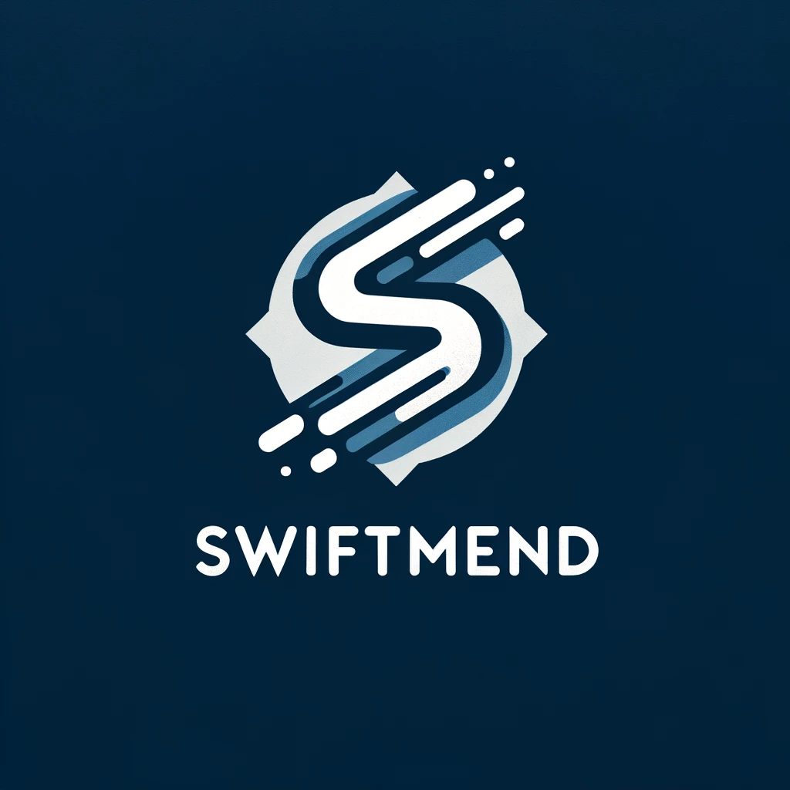

  

# SwiftMend

SwiftMend is an innovative application designed to enhance the accuracy and efficiency of process mining by addressing the issue of quality drift. Our tool specializes in identifying and repairing similar activity labels within stream datasets, a critical step in ensuring the integrity and reliability of process mining results.

## About SwiftMend

In process mining, quality drift can significantly impact the analysis, leading to skewed or inaccurate results. SwiftMend addresses this challenge head-on by providing a robust solution for identifying similar activity labels that often contribute to quality drift in dynamic stream datasets.

### Key Features

- **Real-time Identification:** Swiftly identifies similar activity labels in streaming data, enabling prompt corrections and adjustments.
- **Automatic Repair:** Offers automated suggestions for label corrections, reducing manual effort and increasing efficiency.
- **Data Integrity:** Ensures the accuracy and consistency of your process mining data, leading to more reliable analysis and insights.
- **User-friendly Interface:** Designed with a focus on usability, making it accessible for both technical and non-technical users.
- **Scalability:** Efficiently processes large datasets, ensuring scalability and performance.

